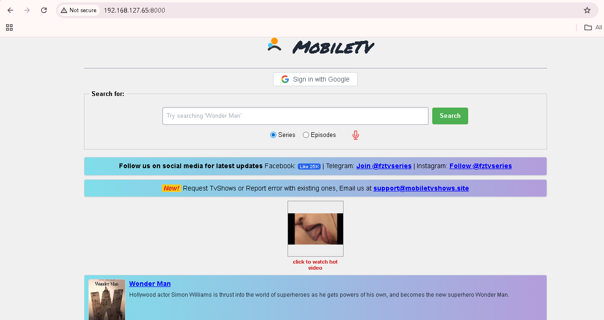
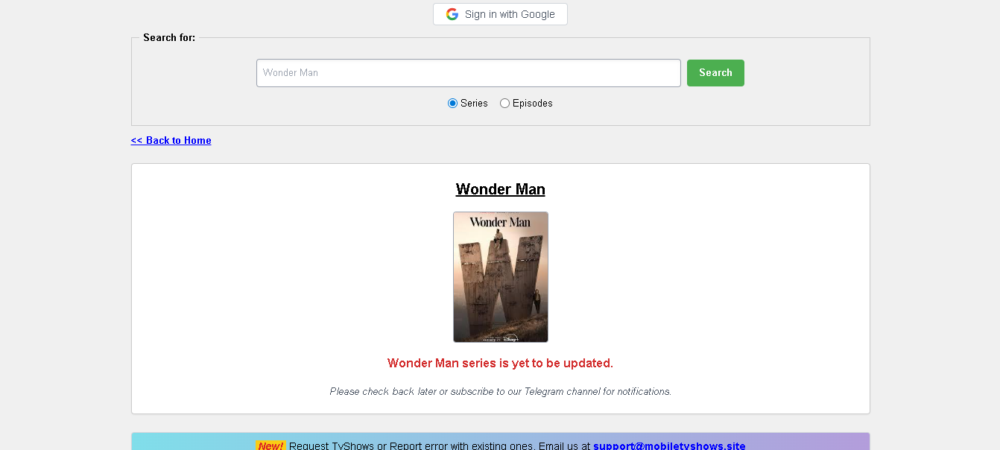
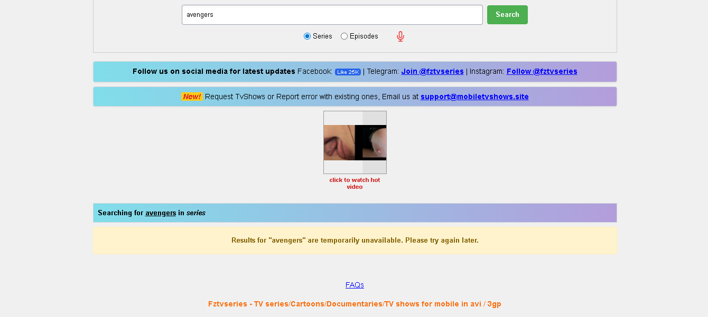

# Django Movie Catalog

## Overview
This is a static movie catalog website built using Django and HTML. It demonstrates front-end and back-end integration, including search functionality, page navigation, and template rendering.

> **Note:** This is a demonstration site. Currently, the search is configured with a sample movie (“Wonderman”) to showcase Django template rendering and search functionality.

## 🚀 Live Demo
[Click here to view](https://your-site-url.com)

## Features
- Search for a movie by title (sample movie available for demo)  
- Navigate between pages  
- Displays a message when a movie is not available  
- Clean, reusable Django templates  

## Tech Stack
- Django  
- HTML / CSS  

## Screenshots

### 💻 Desktop View

## How to Run Locally

📋 Requirements & Setup

To get this project running locally on your machine:

1. Clone the repository:

git clone https://github.com/T-I-W-O/ScholarFlow-Portal.git
cd ScholarFlow-Portal

2. Install Django:

pip install django

3. Database Setup:

python manage.py migrate

4. Run the Server:

python manage.py runserver

5. Open your browser at http://127.0.0.1:8000/ to view the app.

> Note: This project is integrated with the Paystack API. It is currently running in Test Mode, allowing for full end-to-end testing of the scholarship verification flow without processing real currency.

